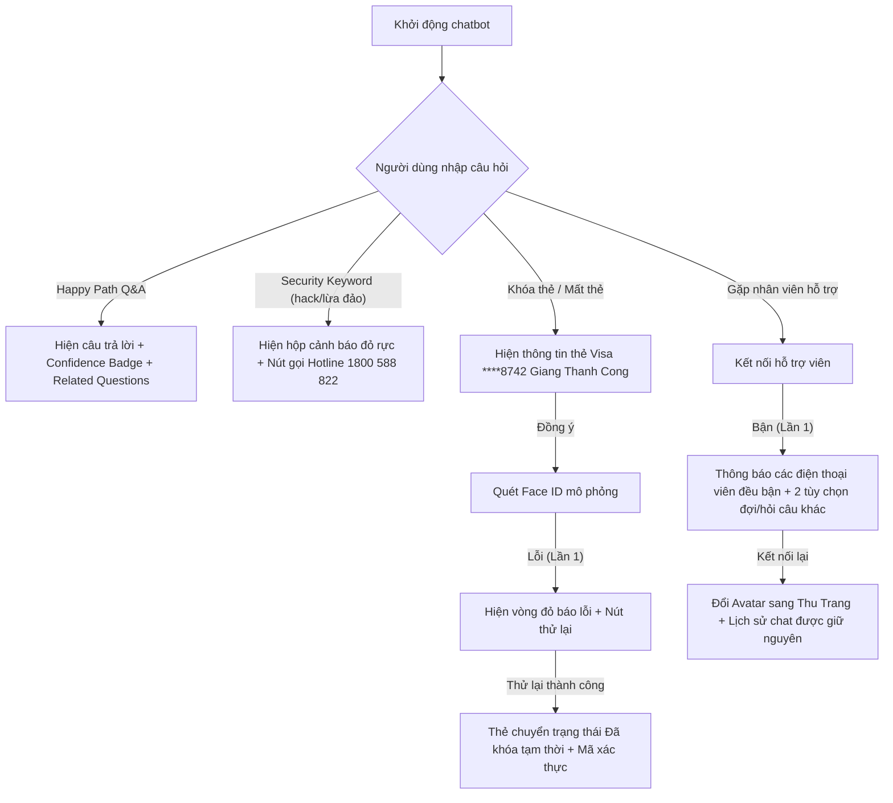

# ĐẶC TẢ SẢN PHẨM — TECHCOMBANK SMART CHATBOT

Tài liệu đặc tả sản phẩm (SPEC) mô tả giải pháp **Chatbot AI tra cứu thông tin thông minh** cho ứng dụng **Techcombank Mobile**.

---

## 1. Lát cắt để build (Build Slice)

Đây không phải là một hệ thống chatbot toàn diện. Prototype tập trung vào một phần nhỏ nhưng quan trọng nhất:
- **Người dùng mục tiêu:** Khách hàng cá nhân Techcombank.
- **Nhiệm vụ chính:** Tra cứu nhanh thông tin dịch vụ như lãi suất, biểu phí thẻ, hạn mức chuyển khoản và thủ tục.
- **AI chịu trách nhiệm:** Phân loại ý định, gọi công cụ tra cứu nội dung (`search_faq`, `search_web`), kích hoạt khóa thẻ (`lock_card`) hoặc chuyển sang người thật (`escalate_to_agent`).
- **Kết quả:** Câu trả lời ngắn gọn, rõ ràng, kèm **độ tin cậy** và câu hỏi mở rộng để giữ người dùng ở lại ứng dụng.

---

## 2. AI Product Canvas

| Ô | Câu hỏi cần trả lời | Giải pháp cho Techcombank Chatbot |
|---|---|---|
| **Value** — Giá trị | Sản phẩm dành cho ai, họ đau ở đâu, và AI giải được điều gì mà cách làm hiện tại chưa giải tốt? | **Dành cho:** Khách hàng cá nhân cần tra cứu nhanh. **Vấn đề:** Phải rời app lên Google, thông tin cũ/cao sai lệch, mất thời gian xác minh. **Giải pháp:** Trả lời nhanh bằng ngôn ngữ tự nhiên, dựa trên dữ liệu chính thức của Techcombank. |
| **Trust** — Niềm tin | Khi AI trả lời sai, người dùng nhận ra bằng cách nào và họ có thể chuyển sang người thật ra sao? | - **Nhãn độ tin cậy** (🟢/🟡/🔴) hiển thị ngay sau câu trả lời. - **Nút "Xem biểu phí gốc"** dẫn đến PDF chính thức. - **Nút "Kết nối hỗ trợ viên"** để chuyển sang hỗ trợ nhân sự khi cần. |
| **Feasibility** — Tính khả thi | Có đáng để build không? Chi phí mỗi lượt gọi, độ trễ, dữ liệu cần, rủi ro lớn nhất? | - **Mô hình:** `gpt-4o-mini` + tìm kiếm cục bộ TF-IDF làm fallback. - **Dữ liệu:** `tcb_faq.json` lấy trực tiếp từ nguồn Techcombank. - **Rủi ro:** AI ảo giác số liệu tài chính và biểu phí. |
| **Tín hiệu học** | Khi người dùng chỉnh sửa kết quả, dữ liệu đó đi về đâu và giúp sản phẩm khá lên nhờ tín hiệu nào? | - Ghi nhận mọi lần bấm **"Báo lỗi/Gặp nhân viên"** và **"Xem biểu phí gốc"** để cải thiện prompt, nội dung FAQ và tuning confidence. |

---

## 3. Bằng chứng thực tế (Evidence)

Nhóm đã kiểm chứng bằng nhiều nguồn, kết hợp trải nghiệm tự dùng, phỏng vấn khách hàng và phân tích đối thủ.

### Phân tích đối thủ cạnh tranh (Competitor Evidence)
- **Timo:** Chatbot FAQ trả lời ngắn gọn, có nguồn trích dẫn rõ ràng.
- **MBBank / VietinBank:** Trợ lý ảo giúp tìm hiểu dịch vụ thẻ, tài khoản bằng ngôn ngữ tự nhiên.
- **Bài học:** Trả lời phải ngắn gọn, có cấu trúc, kèm nguồn chính thức để tạo lòng tin.

### Phỏng vấn khách hàng & đánh giá xã hội (User & Social Evidence)
- **Bạn Công (23 tuổi):**
  > "Mỗi lần muốn xem phí chuyển tiền đi nước ngoài hoặc phí thường niên thẻ là phải lên Google tra cứu, rất mất thời gian. Nhiều lúc Google ra thông tin cũ từ mấy năm trước làm mình bị nhầm lẫn và bị trừ phí oan."

### Trải nghiệm trực tiếp (Self-use Evidence)
Nhóm sử dụng Techcombank Mobile và nhận ra 3 điểm nghẽn chính:
1. **Không có tìm kiếm nhanh từ trang chủ:** không thể nhập câu hỏi trực tiếp ngay khi cần.
   
2. **Sidebar menu tĩnh, rối mắt:** khó tìm lối tắt dịch vụ hoặc hỗ trợ khẩn cấp.
   
3. **Help & Support lỗi thời:** chỉ có link tổng đài và FAQ PDF dài dòng, không trả lời nhanh theo câu hỏi cụ thể.
   

---

## 4. Tăng năng lực hay tự động hóa (Augment/Automate)

Chọn hướng: **Tăng năng lực thông tin**.
- **Vì sao:** Thông tin tài chính cần chính xác, AI chỉ nên là trợ lý cung cấp thông tin và dẫn chứng, không thay người dùng quyết định giao dịch.
- **Ngoại lệ:** **Khóa thẻ khẩn cấp** được tự động hóa khi người dùng báo mất thẻ. AI kích hoạt `lock_card` và mở giao diện Face ID để xác thực ngay.
- **Vai trò con người:** Người dùng là **Decider**; hỗ trợ viên là **Rescuer** khi AI không giải quyết đủ. 

---

## 5. Bốn đường đi của trải nghiệm (Four Paths)

| Đường đi | Tình huống giả định | Hành vi prototype |
|----------|--------------------|------------------|
| **Happy Path** | Hỏi: *"Lãi suất tiết kiệm kỳ hạn 6 tháng?"* | Trả 4.7%/năm, hiển thị `🟢 99%`, gợi ý thêm 3 câu hỏi liên quan. |
| **AI không chắc** | Hỏi ngoài phạm vi: *"Làm sao để làm giàu nhanh?"* | Thông báo không chắc chắn, đề xuất kết nối hỗ trợ viên. |
| **AI sai** | Câu trả lời biểu phí quốc tế bị ảo giác. | Hiển thị `🔴 <40%`, kèm nút **Xem biểu phí gốc** và **Kết nối hỗ trợ viên**. |
| **Người dùng phản hồi** | Khách hàng báo thông tin chưa chính xác. | Chuyển sang chat với Hỗ trợ viên **Thu Trang**, giữ lại lịch sử và đính chính. |

---

## 6. Những kiểu lỗi đáng lo nhất (Most Dangerous Failure Mode)

1. **Ảo giác số liệu tài chính:**
   - AI có thể đưa số liệu biểu phí sai, ví dụ nói miễn phí khi không phải.
   - Hậu quả: khách hàng thực hiện giao dịch, bị trừ phí ngoài dự kiến, gây khiếu nại.
   - Giảm thiểu: `temperature = 0.2` hoặc 0; hạn chế AI trả lời chỉ từ `tcb_faq.json`; kèm link nguồn chính thức.

2. **Vòng lặp UX khi khóa thẻ:**
   - AI hỏi xác nhận nhiều lần, làm trải nghiệm rối và mất thời gian.
   - Giảm thiểu: luồng Face ID một chạm, không hỏi lặp lại sau khi khách hàng đã đồng ý.

---

## 7. Kế hoạch kiểm thử và bằng chứng demo

Prototype đã chuẩn bị 5 kịch bản demo:

### Bằng chứng giao diện demo:

| Màn hình chính & Chatbot gợi ý | Khóa thẻ & Face ID thành công |
|---|---|
|  |  |

---

## 8. Phân công vai trò (Ownership)

- **Giang Thanh Công** (Product Owner / Spec Lead / Presenter): Viết tài liệu SPEC, thiết kế kịch bản giảm ảo giác, chuẩn bị slide thuyết trình và quản lý kiểm thử chất lượng.
- **Nguyễn Minh Hiếu** (AI Developer & QA Tester): Cấu hình prompt cho ReAct Agent, phát triển công cụ gọi hàm (`search_faq`, `search_web`, `lock_card`, `escalate`), xây dựng dữ liệu tri thức tĩnh `tcb_faq.json` và thực hiện kiểm thử tự động.
- **Phạm Văn Công** (UI/UX Builder & Frontend Dev): Phát triển mã nguồn giao diện HTML/CSS, mô phỏng hoạt cảnh Face ID rung lắc báo lỗi, xây dựng thanh Sidebar và các màn hình chuyển tiếp trạng thái.
