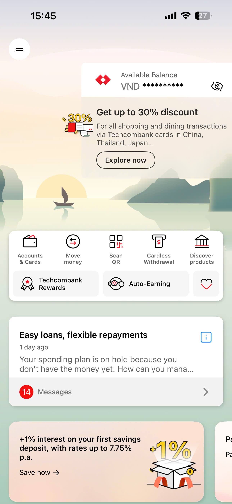
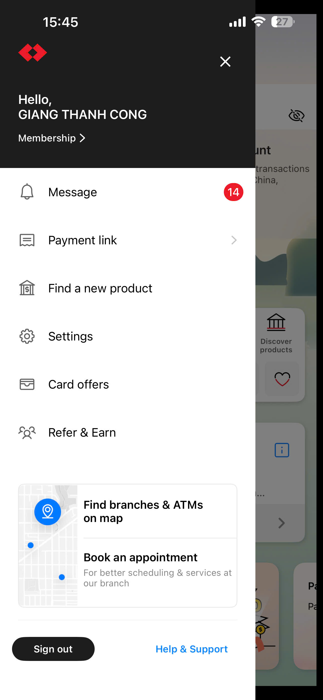
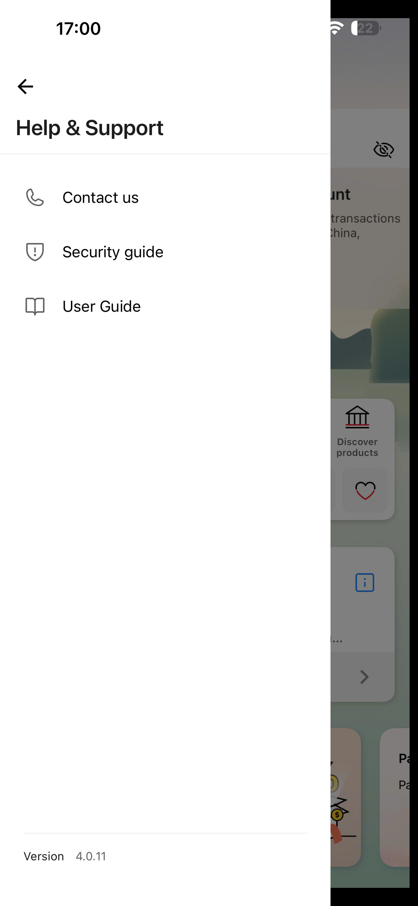
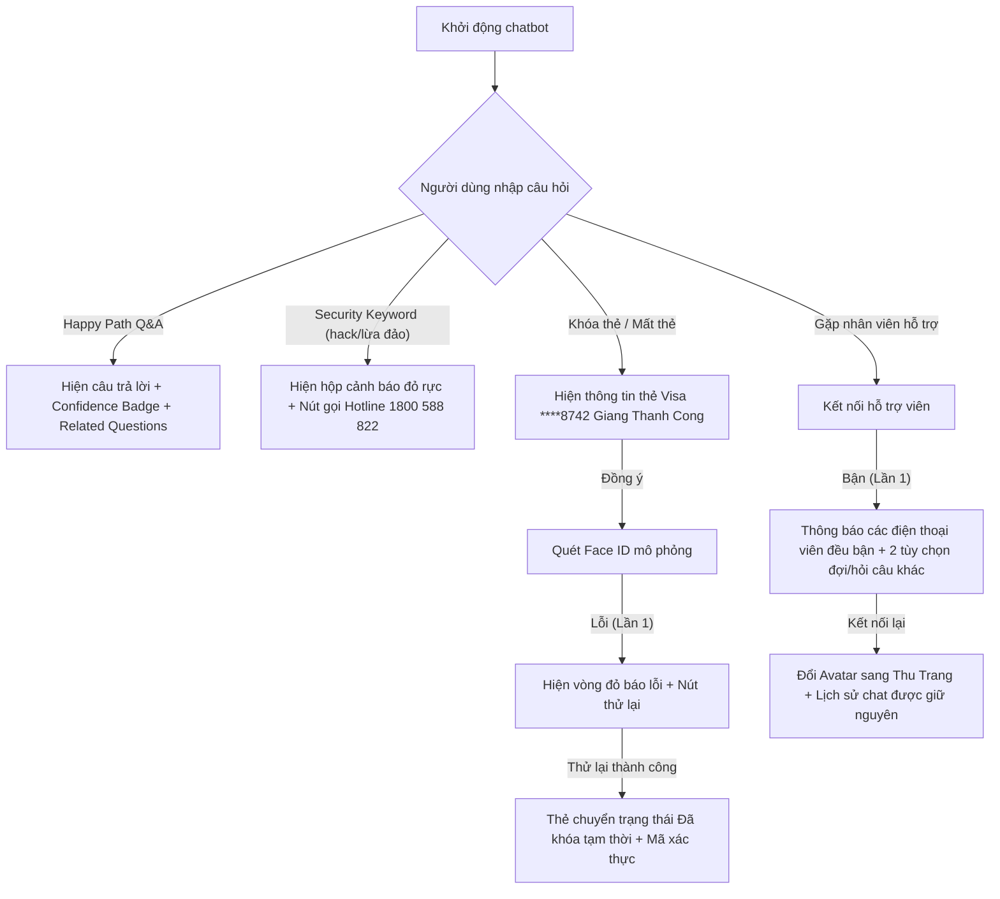
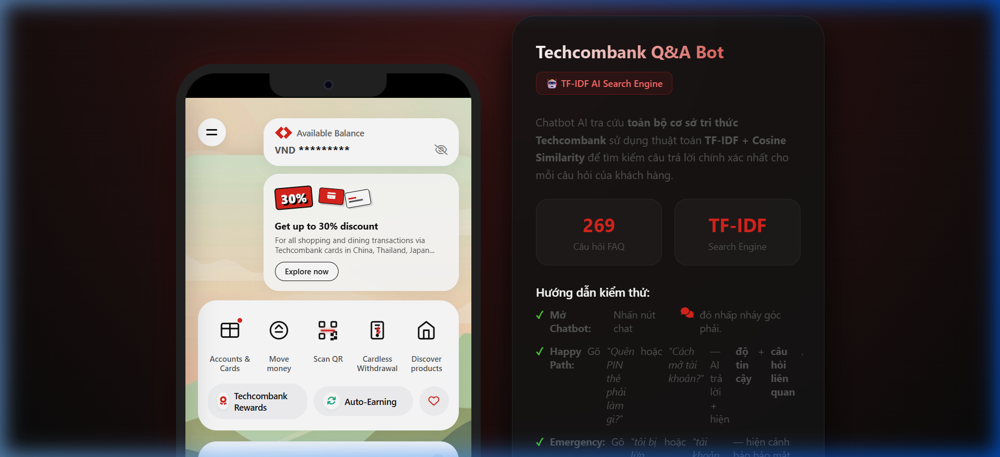
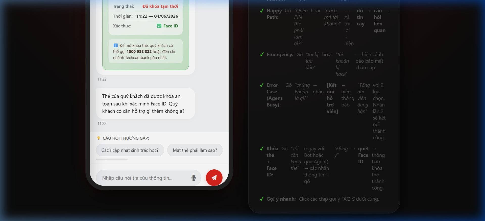

# ĐẶC TẢ SẢN PHẨM — TECHCOMBANK SMART CHATBOT

Tài liệu đặc tả sản phẩm (SPEC) chi tiết cho tính năng **Chatbot AI hỗ trợ tra cứu thông tin thông minh (Q&A)** tích hợp trực tiếp trên ứng dụng **Techcombank Mobile**.

---

## 1. Bằng chứng thực tế (Evidence)

Để thiết kế một giải pháp thực sự giải quyết được khó khăn của khách hàng, nhóm đã nghiên cứu dựa trên quan sát thực tế và phân tích hành vi người dùng.

### Trải nghiệm trực tiếp (Self-use Evidence)
Nhóm nghiên cứu đã sử dụng ứng dụng Techcombank Mobile hàng ngày và phát hiện ra ba điểm nghẽn chính về mặt trải nghiệm tra cứu thông tin:
1. **Thiếu tính năng tìm kiếm nhanh từ màn hình chính:** Người dùng không có cách nào để đặt câu hỏi trực tiếp khi cần tra cứu nhanh.
   
   
   
2. **Menu Sidebar tĩnh và dàn trải:** Các tùy chọn điều hướng trên Sidebar được sắp xếp tĩnh, gây khó khăn cho việc tìm kiếm các lối tắt dịch vụ hoặc thông tin hỗ trợ khẩn cấp.
   
   
   
3. **Trang hỗ trợ "Help & Support" lỗi thời:** Trang hỗ trợ chỉ liên kết đến thông tin liên hệ tổng đài và các hướng dẫn FAQ tĩnh dài dòng dạng PDF hoặc văn bản luật khó hiểu, không trả lời trực tiếp câu hỏi cụ thể của người dùng.
   
   

### Phỏng vấn khách hàng & Đánh giá bên ngoài (User & Social Evidence)
- **Phỏng vấn trực tiếp:** Bạn Công (23 tuổi, khách hàng cá nhân của Techcombank) chia sẻ:
  > *"Mỗi lần muốn xem phí chuyển tiền đi nước ngoài hoặc phí thường niên thẻ là phải lên Google tra cứu, rất mất thời gian. Nhiều lúc Google ra thông tin cũ từ mấy năm trước làm mình bị nhầm lẫn và bị trừ phí oan."*

### Phân tích đối thủ cạnh tranh (Competitor Evidence)
- **Timo (Trợ lý Timo):** Tích hợp chatbot hỏi đáp FAQ trực diện dạng văn bản ngắn gọn kèm nguồn trích dẫn rõ ràng.
- **MBBank & VietinBank (Trợ lý ảo):** Hỗ trợ tìm kiếm thông tin dịch vụ, giải đáp các thắc mắc về thẻ và tài khoản bằng ngôn ngữ tự nhiên.
- **Bài học rút ra:** Cần cung cấp câu trả lời **ngắn gọn dưới 3 dòng**, có cấu trúc rõ ràng và luôn đi kèm **nguồn trích dẫn chính thức** từ ngân hàng để xây dựng niềm tin.

---

## 2. Lát cắt để build (Build Slice)

Thay vì cố gắng xây dựng toàn bộ hệ thống chatbot xử lý mọi giao dịch tài chính phức tạp, prototype này tập trung vào một lát cắt nhỏ nhất nhưng mang lại giá trị cốt lõi cao nhất:
- **Người dùng:** Khách hàng cá nhân Techcombank.
- **Công việc cần làm:** Tra cứu nhanh thông tin dịch vụ (lãi suất, biểu phí thẻ, hạn mức chuyển khoản, thủ tục).
- **AI quyết định:** Phân loại ý định (Intent Detection), quyết định gọi công cụ tra cứu cơ sở tri thức (`search_faq`), công cụ web (`search_web`), kích hoạt khóa thẻ (`lock_card`), hoặc chuyển sang người thật (`escalate_to_agent`).
- **Kết quả trả về:** Câu trả lời ngắn gọn kèm độ tin cậy (%) và các câu hỏi liên quan để người dùng tiếp tục tra cứu mà không cần thoát khỏi ứng dụng.

---

## 3. AI Product Canvas

| Ô | Câu hỏi cần trả lời | Giải pháp cho Techcombank Chatbot |
|---|---|---|
| **Value** — Giá trị | Sản phẩm dành cho ai, họ đau ở đâu, và AI giải được điều gì mà cách làm hiện tại chưa giải tốt? | **Dành cho:** Khách hàng cá nhân cần tra cứu nhanh. **Điểm đau:** Phải thoát app lên Google tra cứu, dễ đọc phải thông tin cũ/giả mạo. **AI giải quyết:** Hỏi đáp bằng ngôn ngữ tự nhiên, trả lời ngay lập tức (<1s) dựa trên cơ sở tri thức chính thức được phê duyệt của Techcombank. |
| **Trust** — Niềm tin | Khi AI trả lời sai, người dùng nhận ra bằng cách nào, và họ sửa lại, hoàn tác hay chuyển sang người thật ra sao? | - **Nhãn độ tin cậy (Confidence Badge)** hiển thị rõ ràng dưới mỗi câu trả lời (🟢/🟡/🔴 %). - **Nút "Xem biểu phí gốc"** dẫn trực tiếp đến link PDF chính thức. - **Nút "Kết nối hỗ trợ viên"** để chuyển ngay sang chat với người thật. |
| **Feasibility** — Tính khả thi | Có đáng để build không? Hãy cân nhắc chi phí mỗi lượt gọi, độ trễ, dữ liệu cần có, rủi ro lớn nhất, và ngưỡng mà nhóm sẵn sàng dừng lại. | - **Chi phí/Độ trễ:** Thấp nhờ sử dụng mô hình tối ưu `gpt-4o-mini` kết hợp tìm kiếm cục bộ **TF-IDF Search Engine** chạy offline làm fallback (0ms delay, $0 cost). **Dữ liệu:** Cơ sở tri thức FAQ (`tcb_faq.json`) được crawl trực tiếp từ website Techcombank. **Rủi ro lớn nhất:** AI bị ảo giác về mặt số liệu tài chính. |
| **Tín hiệu học** | Khi người dùng chỉnh sửa kết quả, dữ liệu đó đi về đâu và giúp sản phẩm khá lên nhờ tín hiệu nào? | - Mọi lượt bấm nút **"Báo lỗi/Gặp nhân viên"** hoặc **"Xem biểu phí gốc"** sau khi bot trả lời sẽ được ghi nhận vào nhật ký hệ thống để tối ưu lại Prompt và cơ sở tri thức FAQ. |

---

## 4. Tăng năng lực hay tự động hóa (Augment/Automate)

Chúng tôi lựa chọn phương án: **Augmentation (Tăng năng lực thông tin)**
- **Lý do lựa chọn:** Thông tin tài chính cần độ chính xác tuyệt đối. AI đóng vai trò như một trợ lý thông minh chuẩn bị thông tin và dẫn nguồn tài liệu tham khảo cho người dùng, thay vì tự ý thực hiện các giao dịch tài chính/chuyển tiền thay khách hàng.
- **Ngoại lệ duy nhất:** **Automate khẩn cấp** đối với tác vụ **Khóa thẻ**. Khi người dùng báo mất thẻ, AI sẽ tự động kích hoạt luồng gọi công cụ hệ thống `lock_card` và hiển thị giao diện Face ID để người dùng xác thực khóa thẻ ngay lập tức nhằm bảo vệ tài sản.
- **Vai trò của con người:** **Decider** (Người dùng tự quyết định dựa trên thông tin AI cung cấp) và **Rescuer** (Hỗ trợ viên trực tuyến tiếp quản đoạn chat khi AI gặp câu hỏi phức tạp).

---

## 5. Bốn đường đi của trải nghiệm (Four Paths)

| Đường đi | Tình huống giả định | Giao diện và phản hồi của Prototype |
|----------|---------|------------------|
| **Happy Path** (AI đúng & tự tin) | Người dùng gõ: *"Lãi suất tiết kiệm kỳ hạn 6 tháng?"* | AI trả về con số chính xác 4.7%/năm, hiện nhãn `🟢 Độ tin cậy: 99%` và 3 câu hỏi liên quan. |
| **Khi AI không chắc** (Low-confidence) | Người dùng hỏi ngoài phạm vi: *"Làm sao để làm giàu nhanh?"* | AI hiển thị thông báo không chắc chắn và đề xuất: *"Bạn có muốn kết nối với hỗ trợ viên tư vấn tài chính trực tiếp?"* kèm nút kết nối. |
| **Khi AI sai** (Failure) | AI bị ảo giác đưa ra sai thông tin biểu phí quốc tế do dữ liệu cũ. | Dưới câu trả lời luôn hiển thị nhãn độ tin cậy thấp `🔴 Độ tin cậy: <40%` kèm nút **[Xem biểu phí gốc]** để đối chiếu và nút **[Kết nối hỗ trợ viên]**. |
| **Khi người dùng sửa** (Correction) | Người dùng phản hồi thông tin không chính xác hoặc bấm nút chuyển tiếp. | Hệ thống chuyển sang chế độ chat với Hỗ trợ viên **Thu Trang (Đang trực tuyến)**, Thu Trang sẽ đọc lại lịch sử chat và đính chính thông tin cho khách hàng. |

---

## 6. Những kiểu lỗi đáng lo nhất (Most Dangerous Failure Mode)

1. **Ảo giác số liệu tài chính (Lãi suất/Biểu phí):**
   - **Tình huống:** AI báo sai mức phí chuyển khoản quốc tế (ví dụ: báo miễn phí nhưng thực tế phí rất cao).
   - **Hậu quả:** Khách hàng thực hiện giao dịch, bị trừ tiền ngoài ý muốn -> Khiếu nại pháp lý dữ dội.
   - **Biện pháp giảm thiểu:**
     - Thiết lập `temperature = 0.2` (hoặc `0` nếu dùng cấu hình cứng) để giảm sự sáng tạo.
     - Sử dụng RAG chặt chẽ, giới hạn AI chỉ trả lời từ tệp dữ liệu được cung cấp (`tcb_faq.json`).
     - Luôn đính kèm liên kết đến biểu phí PDF chính thức của Techcombank để khách hàng tự đối chiếu trước khi thực hiện giao dịch.

2. **Lỗi logic vòng lặp UX (UX Infinite Loop):**
   - **Tình huống:** Khách hàng yêu cầu khóa thẻ, AI hỏi xác nhận, khách hàng đồng ý nhưng AI lại tiếp tục hỏi lại mốc thời gian hoặc yêu cầu xác nhận lần nữa (tương tự như điểm gãy của MoMo Moni).
   - **Biện pháp giảm thiểu:** Kịch bản xác thực Face ID một chạm. Ngay khi người dùng đồng ý khóa thẻ, hệ thống sẽ mở trực tiếp lớp phủ (overlay) Face ID để thực hiện quét lập tức, chuyển trạng thái thẻ sang "Đã khóa tạm thời" mà không hỏi thêm câu hỏi trung gian nào.

---

## 7. Kế hoạch kiểm thử và bằng chứng demo

Hệ thống prototype đã được tích hợp đầy đủ 5 kịch bản kiểm thử (test scenarios) phục vụ cho demo trực quan:

### Bằng chứng giao diện chạy thực tế của Prototype:

| Màn hình chính & Chatbot gợi ý | Khóa thẻ & Face ID thành công |
|---|---|
|  |  |

---

## 8. Phân công vai trò (Ownership)

- **Giang Thanh Công** (Product Owner / Spec Lead / Presenter): Viết tài liệu SPEC, thiết kế kịch bản giảm ảo giác, chuẩn bị slide thuyết trình và quản lý kiểm thử chất lượng.
- **Thành viên 2** (AI Developer & QA Tester): Cấu hình prompt cho ReAct Agent, phát triển công cụ gọi hàm (`search_faq`, `search_web`, `lock_card`, `escalate`), xây dựng dữ liệu tri thức tĩnh `tcb_faq.json` và thực hiện kiểm thử tự động.
- **Thành viên 3** (UI/UX Builder & Frontend Dev): Phát triển mã nguồn giao diện HTML/CSS, mô phỏng hoạt cảnh Face ID rung lắc báo lỗi, xây dựng thanh Sidebar và các màn hình chuyển tiếp trạng thái.
